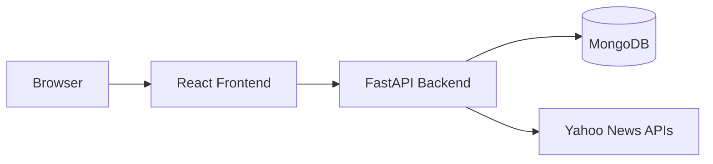

# Quantfi Architecture Document Plan

## Objective

Produce a single markdown document that serves as the **architecture reference** for the Quantfi DCA Intelligence Platform: high-level layout, backend/frontend modules, function definitions and structures, and end-to-end flows (with mermaid diagrams where useful).

---

## Document location and format

- **Path:** [docs/ARCHITECTURE.md](docs/ARCHITECTURE.md) (new file under existing [docs/](docs/) folder).
- **Format:** Markdown with optional mermaid code blocks for diagrams; no emojis.

---

## 1. High-level architecture

- **Stack:** React (Vite) frontend, FastAPI backend, MongoDB, external data (Yahoo Finance, news).
- **Diagram:** System context — Browser, Frontend (React), Backend (FastAPI), MongoDB, External APIs.
- **Repo layout:** `frontend/`, `backend/`, `indicators/`, `validation/`, `backtester/`, `simulations/`, `config/`, `tests/`.

---

## 2. Backend architecture

**Entry and routing**

- [backend/server.py](backend/server.py): FastAPI app, `api_router` with prefix `/api`, CORS, Motor MongoDB client.
- All HTTP endpoints live under `/api` (e.g. `/api/assets`, `/api/dashboard`, `/api/backtest`).

**Core modules (with file paths and main functions)**

| Module               | File                                                                       | Key types / functions                                                                                                                                                                                                                                        |
| -------------------- | -------------------------------------------------------------------------- | ------------------------------------------------------------------------------------------------------------------------------------------------------------------------------------------------------------------------------------------------------------ |
| Models               | [backend/models.py](backend/models.py)                                     | `Asset`, `PriceData`, `IndicatorData`, `ScoreBreakdown`, `DCAScore`, `NewsEvent`, `BacktestConfig`, `BacktestResult`, `UserSettings`, `SimulationRequest`, `SimulationExitConfig`                                                                            |
| Config               | [backend/app_config.py](backend/app_config.py)                             | `get_backend_config()` — TTLs, score zones, LLM keys                                                                                                                                                                                                         |
| Data providers       | [backend/data_providers.py](backend/data_providers.py)                     | `PriceProvider.fetch_latest_price`, `fetch_historical_data`; `FXProvider.fetch_usd_inr_rate`; `NewsProvider.fetch_latest_news`, `fetch_news_for_assets`; `SymbolResolver`                                                                                    |
| Indicators (backend) | [backend/indicators.py](backend/indicators.py)                             | `TechnicalIndicators`: `calculate_all_indicators`, `calculate_sma`, `calculate_ema`, `calculate_rsi`, `calculate_macd`, `calculate_bollinger_bands`, `calculate_atr`, `calculate_atr_percentile`, `calculate_z_score`, `calculate_drawdown`, `calculate_adx` |
| Scoring              | [backend/scoring.py](backend/scoring.py)                                   | `ScoringEngine.calculate_composite_score`, `get_zone`, `calculate_technical_momentum_score`, `calculate_volatility_opportunity_score`, `calculate_statistical_deviation_score`, `calculate_macro_fx_score`                                                   |
| Backtest (server)    | [backend/backtest.py](backend/backtest.py)                                 | `BacktestEngine.run_backtest`, `_compute_rolling_scores`                                                                                                                                                                                                     |
| LLM                  | [backend/llm_service.py](backend/llm_service.py)                           | `LLMService.generate_score_explanation`, `classify_news_event`                                                                                                                                                                                               |
| Sentiment            | Loaded from [indicators/sentiment_agent.py](indicators/sentiment_agent.py) | `full_sentiment_analysis`, `compute_sentiment_G_t` (via `_get_sentiment_mod()` in server)                                                                                                                                                                    |

**API endpoint summary (from server.py)**

- Assets: `POST /assets`, `GET /assets`, `DELETE /assets/{symbol}`.
- Prices: `GET /prices/{symbol}`, `GET /prices/{symbol}/history`.
- Indicators / scores: `GET /indicators/{symbol}`, `GET /scores/{symbol}`.
- Backtest: `POST /backtest` (and enhanced if present).
- News: `GET /news`, `GET /news/asset/{symbol}`, `POST /news/refresh`.
- Sentiment: `GET /sentiment/{symbol}`, `POST /sentiment/{symbol}`.
- Dashboard: `GET /dashboard` (aggregates assets + latest score/price/indicators per asset).
- Settings: `GET /settings`, `PUT /settings`.
- Simulation: `GET /simulation/templates`, `GET /simulation/cost-presets`, `POST /simulation/run`.
- Health: `GET /health`.

**Server-side flow (add asset → dashboard)**

- `add_asset` → insert/update `assets` collection → background task `fetch_and_calculate_asset_data(symbol, ...)` → fetch price (PriceProvider), FX (FXProvider), compute indicators (TechnicalIndicators), composite score (ScoringEngine), persist to `price_history`, `indicators`, `scores`.
- `get_dashboard` → read active assets from `assets` → for each symbol, latest from `scores`, `price_history`, `indicators` → return `{ assets: [...] }`.

---

## 3. Frontend architecture

**Entry and routing**

- [frontend/src/index.js](frontend/src/index.js): mounts `App` with `index.css`.
- [frontend/src/App.js](frontend/src/App.js): `BrowserRouter`, `WatchlistProvider` wrapping layout, `Routes` for `/`, `/assets`, `/assets/:symbol`, `/backtest`, `/simulation`, `/news`, `/settings`. Add Asset dialog state and `handleAddAsset`; global events `addAsset`, `refreshDashboard`.

**Context**

- [frontend/src/contexts/WatchlistContext.js](frontend/src/contexts/WatchlistContext.js): `WatchlistProvider`, `useWatchlist()`. State: `dashboardData` (from `api.getDashboard()`), `loading`, `refreshing`, `error`. Derived: `assetList`. Actions: `refresh()`, `removeAsset(symbol)`. Listens to `refreshDashboard`.

**API layer**

- [frontend/src/api.js](frontend/src/api.js): single `api` object; base `BACKEND_URL` / `API`; methods: `getAssets`, `addAsset`, `removeAsset`, `getLatestPrice`, `getPriceHistory`, `getIndicators`, `getScore`, `getDashboard`, `runBacktest`, `getNews`, `refreshNews`, `getSentiment`, `runSentiment`, `getSettings`, `updateSettings`, `runSimulation`, `getSimulationTemplates`, `getSimulationCostPresets`, etc.

**Pages (file and responsibility)**

- **Dashboard** ([frontend/src/pages/Dashboard.js](frontend/src/pages/Dashboard.js)): watchlist overview, DCA scores/zones, Opportunity Radar, Portfolio Health, Allocation, Smart Alerts, Quick Glance; uses `useWatchlist`, shared components.
- **Assets** ([frontend/src/pages/Assets.js](frontend/src/pages/Assets.js)): watchlist table, filters, score heatmap, remove asset.
- **AssetDetail** ([frontend/src/pages/AssetDetail.js](frontend/src/pages/AssetDetail.js)): single-asset price, indicators, score, sentiment, news.
- **BacktestLab** ([frontend/src/pages/BacktestLab.js](frontend/src/pages/BacktestLab.js)): symbol picker (AssetPicker), date range, DCA params, run backtest, show equity curve and KPIs.
- **PortfolioSim** ([frontend/src/pages/PortfolioSim.js](frontend/src/pages/PortfolioSim.js)): templates, run simulation, Overview/Costs/Sensitivity tabs.
- **News** ([frontend/src/pages/News.js](frontend/src/pages/News.js)): news feed, filter by asset, refresh.
- **Settings** ([frontend/src/pages/Settings.js](frontend/src/pages/Settings.js)): DCA defaults, score weights, execution model, etc.
- **ValidationLab** ([frontend/src/pages/ValidationLab.js](frontend/src/pages/ValidationLab.js)): Phase 3 validation UI; not mounted in router.

**Shared components**

- [frontend/src/components/shared/index.js](frontend/src/components/shared/index.js): barrel for `StatCard`, `ScoreBar`, `ZoneBadge`, `RefreshButton`, `PageShell`, `AssetPicker`, `FilterTabs`, `MetricGrid`.
- UI primitives under [frontend/src/components/ui/](frontend/src/components/ui/): `dialog`, `button`, `input`, `label`, `select`, `tabs`, etc.

---

## 4. Python packages (outside backend server)

**indicators/** ([indicators/**init**.py](indicators/__init__.py))

- Purpose: Phase 1/A/B composite scores, normalization, microstructure (OFI, Hawkes), sentiment, trend, volatility, liquidity, geopolitics, LDC, committee.
- Key exports (representative): `IndicatorEngine`, `compute_all_indicators`; `compute_composite_score`, `CompositeResult`, `Phase1Composite`; `compose_scores`, `PhaseAConfig`, `load_phaseA_config`; `full_sentiment_analysis`, `compute_sentiment_G_t`; `compute_ofi`, `estimate_hawkes`; normalization helpers (`expanding_percentile`, `normalize_to_score`, etc.); `walkforward_cv` not in indicators but in validation.

**validation/** ([validation/**init**.py](validation/__init__.py))

- Purpose: Phase B+3 validation, metrics, walk-forward, purged K-fold, data integrity, execution model (slippage, costs), tuning, report generation.
- Key exports: `walkforward_cv`, `purged_kfold`, `validate_dataframe`, `generate_report`, `ExecutionConfig`, `apply_execution_costs`, `run_tuning`, `ablation_study`, etc.

**backtester/** ([backtester/**init**.py](backtester/__init__.py))

- Purpose: DCA backtest, diagnostic backtester, purged validation, signal sweep, DCA portfolio sim, and the **portfolio simulator** used by the API.
- Key for API: [backtester/portfolio_simulator.py](backtester/portfolio_simulator.py) — `PortfolioSimulator`, `SimConfig`, `ExitParams`, `prepare_multi_asset_data`, `run`, `COST_PRESETS`; server calls these in `run_simulation`, `get_simulation_templates`, `get_cost_presets`.

**simulations/** ([simulations/**init**.py](simulations/__init__.py))

- Purpose: Hawkes process simulation, synthetic LOB/trade generation (Phase 3).
- Key exports: `simulate_hawkes_events`, `generate_synthetic_lob`, `generate_synthetic_trades`, etc.

---

## 5. Key end-to-end flows (with function chains)

**Flow A: Add asset and see it on dashboard**

1. User clicks "ADD ASSET" → `addAsset` event or Sidebar `onAddAsset` → App opens Dialog.
2. User submits form → `handleAddAsset` in App → `api.addAsset(payload)` → backend `POST /api/assets` → `add_asset()` → insert/update `assets`, `asyncio.create_task(fetch_and_calculate_asset_data(...))`.
3. After success: App dispatches `refreshDashboard` → WatchlistContext `fetchData(true)` → `api.getDashboard()` → backend `get_dashboard()` → returns `{ assets: dashboard_data }` → context updates → Dashboard re-renders with new asset.

**Flow B: Backtest**

1. User selects symbol (AssetPicker from `assetList`), dates, DCA amount/cadence → Run → `api.runBacktest(config)` → `POST /api/backtest` → `run_backtest()` → `BacktestEngine.run_backtest()` → returns equity curve and KPIs → BacktestLab displays chart and metrics.

**Flow C: Portfolio simulation**

1. User picks template (or custom), runs sim → `api.runSimulation(data)` → `POST /api/simulation/run` → server loads `backtester.portfolio_simulator`, `prepare_multi_asset_data`, `PortfolioSimulator.run()` → returns results → PortfolioSim shows Overview/Costs/Sensitivity.

**Flow D: News refresh**

1. User clicks Refresh on News → `api.refreshNews()` → `POST /api/news/refresh` → `refresh_news()` → fetch + classify (LLM), store in `news_events` → frontend re-fetches `getNews()` to show updated feed.

Document will describe each flow with **function names and file paths** (as in the tables above) so developers can jump to definitions.

---

## 6. Data structures (summary)

- **Backend:** Pydantic models in [backend/models.py](backend/models.py) — field-level summary for `Asset`, `PriceData`, `IndicatorData`, `DCAScore` (with `ScoreBreakdown`), `NewsEvent`, `BacktestConfig`/`BacktestResult`, `SimulationRequest`/exit config.
- **Frontend:** Dashboard payload shape `{ assets: [{ asset, score, price, indicators }] }`; backtest/simulation response shapes as returned by API (equity curve, KPIs, cost breakdown).
- **MongoDB collections:** `assets`, `price_history`, `indicators`, `scores`, `news_events`, `user_settings`, `backtest_results`, `sentiment`, `simulation_results` (as used in server).

---

## 7. Document outline (sections to write)

1. **Title and overview** — one short paragraph on what Quantfi is and what the doc covers.
2. **High-level architecture** — stack, repo layout, system-context diagram.
3. **Backend** — entry, routing, API table, modules table (with file paths and main functions), server-side add-asset and dashboard flow.
4. **Frontend** — entry, routing, WatchlistContext, api.js surface, pages table, shared components.
5. **Python packages** — indicators, validation, backtester, simulations (purpose and key exports).
6. **Key flows** — Add asset → Dashboard; Backtest; Portfolio simulation; News refresh (with function chains and file references).
7. **Data structures** — backend models summary, dashboard and API response shapes, MongoDB collections.
8. **Optional:** Glossary (DCA, composite score, zone, etc.) and "Where to find X" index (e.g. "Add asset logic" → server.py `add_asset`, App.js `handleAddAsset`).

---

## 8. Implementation notes

- **No code changes** to application logic; only add [docs/ARCHITECTURE.md](docs/ARCHITECTURE.md).
- Use **relative links** to repo files (e.g. `[backend/server.py](backend/server.py)`).
- Keep **function/type names** accurate so search-and-navigate stays valid.
- Mermaid diagrams: use valid IDs (no spaces, avoid reserved words), double-quote edge labels if needed.

