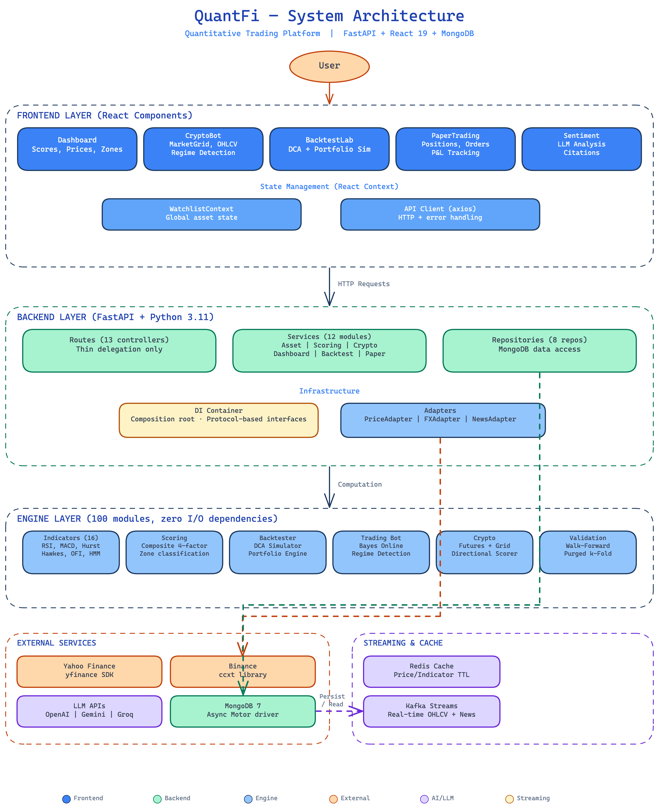

<h1 align="center">QuantFi</h1>

<p align="center">
  Quantitative trading platform with crypto bot, DCA intelligence, and sentiment-driven scoring.
</p>

<p align="center">
  
  
  
  
  
  
  
  
</p>

---

## Table of Contents

- [What is QuantFi](#what-is-quantfi)
- [Architecture](#architecture)
- [Mathematical Foundations](#mathematical-foundations)
- [Novelties](#novelties)
- [Features](#features)
- [Tech Stack](#tech-stack)
- [Getting Started](#getting-started)
- [Project Structure](#project-structure)
- [Configuration](#configuration)
- [Design Patterns](#design-patterns)
- [Testing](#testing)
- [Deployment](#deployment)
- [References](#references)
- [License](#license)

---

## What is QuantFi

QuantFi is a full-stack quantitative trading platform that scores assets on a 0-100 scale using multi-factor analysis, then acts on those signals through automated crypto trading strategies. It combines three core systems:

1. **Trading Bot** — Perpetual futures and grid trading on Binance with HMM regime detection, Bayesian online learning, and adaptive position sizing via IC-EWMA weight optimization.
2. **DCA Intelligence** — Multi-factor composite scoring engine that fuses technical indicators, volatility metrics, statistical deviations, and macro conditions into a single actionable score with zone classification.
3. **Sentiment Analysis** — LLM-powered news classification with source agreement scoring, citation tracking, and a sentiment gate multiplier `G(t)` that modulates DCA scores based on market narrative.

The platform is designed for personal portfolio research, strategy backtesting, and paper trading. It is not financial advice.

---

## Architecture

<p align="center">
  
</p>

The system is organized into four layers. The **Frontend Layer** (React 19 + Vite) manages UI state through `WatchlistContext` and a dedicated API client. The **Backend Layer** (FastAPI) follows Repository-Service-Controller with protocol-based dependency injection — routes are thin controllers, services hold business logic, repositories abstract MongoDB. The **Engine Layer** is a pure computation package (100 modules, zero I/O) containing all indicators, scoring, backtesting, and validation logic. **External Services** (Yahoo Finance, Binance via ccxt, LLM APIs) are accessed through adapter interfaces, while the **Streaming & Cache** layer provides Kafka-backed real-time ingestion and Redis-backed low-latency materialization.

---

## Mathematical Foundations

The scoring engine, trading bot, and validation framework are built on concrete mathematical formulations rather than heuristic rules.

### Composite DCA Score

The favorability score is a weighted linear combination of four sub-scores, each derived from piecewise rule functions applied to raw indicator values:

```math
\begin{aligned}
S_{\mathrm{composite}}
&= w_{\mathrm{tm}} S_{\mathrm{tech}}
 + w_{\mathrm{vo}} S_{\mathrm{vol}}
 + w_{\mathrm{sd}} S_{\mathrm{stat}}
 + w_{\mathrm{fx}} S_{\mathrm{fx}}
\end{aligned}
```

Default weights: `w_tm = 0.40`, `w_vo = 0.20`, `w_sd = 0.20`, `w_fx = 0.20`. Each sub-score is clamped to `[0, 100]` and derived from configurable rule tables in `config/settings.yml`.

The **Phase 1 composite** extends this with a persistence gate and opportunity measure:

```math
g_{\mathrm{pers}}(H) = \mathrm{clip}\left(2 \cdot \sigma\left(k(H-0.5)\right), 0, 1\right), \quad k = 10
```

```math
\mathrm{Opp}_t = \mathrm{mean}\left(T_t, U_t \cdot g_{\mathrm{pers}}(H_t)\right)
```

```math
\mathrm{Gate}_t = C_t \cdot L_t \cdot R_{\mathrm{pass}}
```

```math
\mathrm{RawFavor}_t = \mathrm{Opp}_t \cdot \mathrm{Gate}_t
```

```math
\mathrm{Score}_t = 100 \cdot \mathrm{clip}\left(0.5 + (\mathrm{RawFavor}_t - 0.5)\cdot S_{\mathrm{scale}}, 0, 1\right)
```

Where `T_t` is trend, `U_t` undervaluation, `H_t` Hurst exponent, `C_t` coupling, `L_t` liquidity, and `R_pass` the regime filter.

### Hawkes Process Intensity

Self-exciting point process for modeling trade arrival clustering. The intensity function with exponential kernel:

```math
\lambda(t) = \mu + \sum_{t_i < t}\alpha e^{-\beta(t-t_i)}
```

Parameters are estimated by maximizing the log-likelihood via L-BFGS-B:

```math
\begin{aligned}
\mathcal{L}
&= \sum_i \log \lambda_i - \mu T \\
&\quad - \frac{\alpha}{\beta}\sum_i\left(1-e^{-\beta(T-t_i)}\right)
\end{aligned}
```

Subject to constraints `mu > 0`, `alpha >= 0`, `beta > 0`, `alpha < beta` (stationarity). Used in `engine/simulations/hawkes_simulator.py` for synthetic LOB generation and in `engine/indicators/hawkes.py` for trade intensity features.

### Hurst Exponent (R/S Method)

Measures long-range dependence in price series. For each subseries of length `n`, compute the rescaled range `R/S`:

```math
\begin{aligned}
\frac{R}{S} &= \frac{\max(Y_k)-\min(Y_k)}{\mathrm{std}(x)} \\
Y_k &= \sum_{j=1}^{k}(x_j-\bar{x})
\end{aligned}
```

The Hurst exponent is the OLS slope of `log(R/S)` vs `log(n)` across multiple scales, with finite-sample shrinkage:

```math
H = 0.5 + (H_{\mathrm{raw}}-0.5)\cdot\min\left(1,\sqrt{\frac{n}{512}}\right)
```

`H > 0.5` indicates persistence (trending), `H < 0.5` indicates mean-reversion. Implemented in `engine/indicators/hurst.py` with wavelet fallback via `pywt.wavedec`.

### Bayesian Online Learning

The trading bot maintains a recursive Bayesian linear regression for real-time score recalibration with forgetting factor $\lambda$:

```math
\Sigma_{t+1}^{-1} = \frac{1}{\lambda}\Sigma_t^{-1} + \frac{1}{\sigma^2}x_t x_t^\top
```

```math
\mu_{t+1} = \Sigma_{t+1}\left(\frac{1}{\lambda}\Sigma_t^{-1}\mu_t + \frac{1}{\sigma^2}x_t y_t\right)
```

Hierarchical extension (`BayesHierarchical`) applies cross-regime shrinkage: `mu_r <- (1 - eta) * mu_r + eta * mu_global` after each regime-specific update.

### IC-EWMA Adaptive Weights

Component weights adapt based on Information Coefficient (Spearman rank correlation with forward returns), smoothed with exponential weighting:

```math
\mathrm{EWMA}_t = (1-\beta)\mathrm{EWMA}_{t-1} + \beta\,\mathrm{IC}^{\mathrm{raw}}_t, \quad \beta = 0.1
```

```math
z_i = \frac{\mathrm{EWMA}_i-\mu}{\sigma+\varepsilon}
```

```math
w_i = (1-\lambda)\frac{e^{\alpha z_i}}{\sum_j e^{\alpha z_j}} + \frac{\lambda}{n}
```

Per-step movement is capped at `delta_max` and weights are projected back onto the simplex. Implemented in `engine/weights/ic_ewma.py`.

### ECDF-Sigmoid Normalization

All indicator components are normalized through an expanding empirical CDF followed by a probit-sigmoid transform:

```math
p_t = \frac{\#\{x_s<x_t\}+0.5\,\#\{x_s=x_t\}}{n_t}
```

```math
z_t = \Phi^{-1}\left(\mathrm{clip}(p_t,\varepsilon,1-\varepsilon)\right)
```

```math
s_t = \frac{1}{1+e^{-k z_t}}
```

This produces a `[0, 1]` score with correct statistical calibration regardless of the raw indicator's distribution.

### Directional Scorer (Crypto)

Ten technical components are combined via IC-EWMA weights or uniform averaging. Each component uses self-calibrating tanh compression:

```math
\mathrm{score}_i = \tanh\left(\frac{\mathrm{raw}_i}{\sigma_{\mathrm{roll},i}}\right)\cdot 100
```

Where `sigma_roll` is the rolling standard deviation of the signal, making the scoring automatically adaptive to changing volatility regimes. A volatility dampening filter attenuates signals during extreme ATR percentiles.

### ATR Trailing Stop

Position exit management uses a three-way maximum of trailing, initial, and minimum stops:

```math
\mathrm{trail\_stop} = P_{\mathrm{peak}}-m_{\mathrm{trail}}\cdot ATR \cdot w_{\mathrm{vol}}
```

```math
\mathrm{init\_stop} = P_{\mathrm{entry}}-m_{\mathrm{init}}\cdot ATR \cdot w_{\mathrm{vol}}
```

```math
\mathrm{min\_stop} = P_{\mathrm{entry}}\left(1-\frac{\mathrm{min\_stop\_pct}}{100}\right)
```

```math
\mathrm{stop} = \max(\mathrm{trail\_stop},\mathrm{init\_stop},\mathrm{min\_stop})
```

Exit triggers when `close <= stop`, with additional exits on score deterioration (`score < entry_score * rel_mult AND score < abs_floor`) and maximum holding period.

---

## Novelties

### Real-Time Data Streaming

Market data flows through a Kafka-based streaming pipeline for low-latency ingestion:

- **OHLCV stream** — Yahoo Finance and Binance WebSocket feeds are published to Kafka topics, consumed by the backend, and materialized into the indicator pipeline with sub-second latency.
- **News stream** — RSS and API feeds are polled, classified by the LLM sentiment service, and published as scored events. Downstream consumers update asset sentiment gates in real-time.
- **Backpressure handling** — Consumer lag is monitored; if processing falls behind, the system drops to snapshot mode (latest bar only) rather than queuing stale data.

### Multi-Layer Caching

Response times are optimized through a tiered caching strategy:

| Layer | Technology | TTL | What |
|-------|-----------|-----|------|
| **L1 — In-Memory** | Python `lru_cache` | Request-scoped | Config objects, parsed YAML |
| **L2 — Redis** | Redis 7 | Configurable per resource | Prices (5min), indicators (1hr), scores (2hr), news (6hr) |
| **L3 — MongoDB** | Document TTL indexes | Configurable | Historical indicator/score snapshots, trade logs |

Cache invalidation follows a write-through pattern: when a service computes fresh data, it writes to both Redis and MongoDB simultaneously. Reads check L1, then L2, then L3, falling through to live computation only on full cache miss.

### Purged Walk-Forward Validation

The backtesting framework implements purged k-fold cross-validation from [de Prado, 2018] to prevent information leakage between train and test sets:

- **Purging** — Observations within an embargo window of test-set boundaries are removed from the training set.
- **Combinatorial purged CV** — All possible train/test path combinations are evaluated, producing a distribution of out-of-sample performance rather than a single point estimate.
- **Walk-forward analysis** — Expanding-window retraining with contiguous out-of-sample segments simulates realistic deployment conditions.

### Self-Calibrating Signals

All crypto directional components use self-calibrating tanh compression rather than fixed thresholds. The rolling standard deviation of each signal normalizes the raw value before the `tanh` squash, making the system automatically adaptive to volatility regime changes without manual parameter tuning.

### Regime-Aware Allocation

Portfolio construction adjusts allocations based on the HMM-detected regime:

- **Risk-on** (bull regime): `95%` equity allocation, full scoring-weighted entry.
- **Risk-off** (bear regime): `60%` equity allocation, tighter stops, score threshold raised.
- **Drawdown circuit breaker**: If portfolio drawdown exceeds `-15%`, allocation drops to minimum until recovery.

---

## Features

### Trading Bot

- Perpetual futures engine with directional scoring and adaptive position sizing
- Grid trading engine with dynamic grid spacing and profit locking
- HMM regime detection (bull / bear / sideways) with rolling probability windows
- Bayesian online learning for real-time score recalibration
- Realistic cost modeling: funding rates, slippage, maker/taker fees, Indian tax

### DCA Scoring Engine

- Four-factor composite: technical momentum, volatility opportunity, statistical deviation, macro/FX
- Zone classification: `STRONG BUY` / `FAVORABLE` / `NEUTRAL` / `UNFAVORABLE`
- Configurable weights, thresholds, and normalization methods
- Score-driven DCA timing with dip-buying triggers

### Sentiment Analysis

- LLM-powered event classification from news, Reddit, and financial blogs
- Source agreement scoring and citation tracking per factor
- Sentiment gate `G(t)` that amplifies or dampens DCA scores
- Supports OpenAI, Google Gemini, and Groq as LLM backends

### Portfolio Simulation

- Multi-asset tactical portfolio simulator with regime-aware allocation
- ATR-based trailing exit management with jump-diffusion cost modeling
- Equity curve visualization with benchmark overlays
- Configurable templates: conservative, aggressive, income, momentum

### Backtesting and Validation

- Single-asset DCA backtest with score-driven entry timing
- Purged k-fold cross-validation and walk-forward analysis
- Hawkes process simulation for synthetic trade generation
- IC-EWMA adaptive weight optimization

### Paper Trading

- Persistent order book with MongoDB-backed position tracking
- Buy/sell execution using live market prices
- Real-time P&L calculation and trade history
- Portfolio reset and snapshot functionality

---

## Tech Stack

| Layer | Technologies |
|-------|-------------|
| **Frontend** | React 19, Vite 6, Tailwind CSS 4, Radix UI, Recharts, Lucide Icons |
| **Backend** | Python 3.11+, FastAPI, Pydantic v2, Motor (async MongoDB) |
| **Database** | MongoDB 7 (document store + TTL indexes) |
| **Cache** | Redis 7 (tiered TTL caching for prices, indicators, scores) |
| **Streaming** | Apache Kafka (real-time OHLCV + news ingestion) |
| **Engine** | NumPy, Pandas, SciPy, scikit-learn, hmmlearn, ccxt |
| **AI / LLM** | OpenAI API, Google Gemini API, Groq API |
| **DevOps** | Docker, docker-compose, GitHub Actions CI, Playwright (E2E) |

---

## Getting Started

### Prerequisites

| Requirement | Version | Notes |
|-------------|---------|-------|
| Python | 3.11+ | Backend and engine |
| Node.js | 20+ | Frontend build |
| MongoDB | 7+ | Local install or Docker |

### Option A: Docker (recommended)

```bash
git clone https://github.com/your-username/quantfi.git
cd quantfi

cp .env.example .env
# Edit .env — add your API keys

docker-compose up --build
```

| Service | URL |
|---------|-----|
| Frontend | `http://localhost:3000` |
| Backend | `http://localhost:8000` |
| Swagger Docs | `http://localhost:8000/docs` |

### Option B: Manual setup

```bash
git clone https://github.com/your-username/quantfi.git
cd quantfi
```

**Backend:**

```bash
cd backend
python -m venv .venv
source .venv/bin/activate      # Windows: .venv\Scripts\activate
pip install -r requirements.txt
```

**Frontend:**

```bash
cd ../frontend
npm install
```

**Environment:**

```bash
cd ..
cp .env.example backend/.env
# Edit backend/.env with your MongoDB URL and API keys
```

**Run:**

```bash
./start.sh
```


---

## Configuration

All tunable parameters live in `config/settings.yml`. No hardcoded magic numbers in the codebase.

| Section | Key Parameters |
|---------|---------------|
| **Indicators** | RSI period (14), MACD fast/slow/signal (12/26/9), Bollinger period/std (20/2), ATR period (14), z-score windows [20, 50, 100] |
| **Scoring** | Component weights, zone thresholds (80/60/40), base score (50), top-factor count |
| **Cache** | TTL for prices (5min), indicators (1hr), scores (2hr), news (6hr) |
| **Backtest** | Default DCA amount, cadence, dip threshold |
| **Crypto** | Exchange (binance), timeframes, position sizing, cost model parameters |

---

## Design Patterns

| Pattern | Location | Purpose |
|---------|----------|---------|
| **Repository-Service-Controller** | `backend/` | Separation of data access, business logic, and HTTP |
| **Dependency Injection** | `backend/core/container.py` | Composition root wires all dependencies at startup |
| **Protocol Interfaces** | `backend/core/protocols.py` | `typing.Protocol` for adapter abstraction (Open/Closed Principle) |
| **Strategy** | `engine/crypto/strategies/` | Interchangeable trading strategies (directional, grid, adaptive) |
| **Facade** | `backend/services/scoring_service.py` | Multi-step scoring behind a single interface |
| **Template Method** | `engine/validation/` | Walk-forward and purged k-fold share validation skeleton |
| **Observer** | `frontend/src/contexts/` | React Context + custom events for real-time watchlist sync |
| **Factory** | `engine/weights/` | `WeightingFactory` produces IC-EWMA or Kalman weight strategies |

---

## Testing

```bash
# Python unit tests
PYTHONPATH=. python -m pytest tests -q

# Frontend tests
cd frontend && npx vitest run

# End-to-end
npx playwright test

# All tests
npm test
```

58 test files covering indicators, scoring, backtester, crypto engines, regime detection, validation, and API integration.

---

## Deployment

### Docker (production)

```bash
docker build -t quantfi .
docker run -p 8000:8000 --env-file .env quantfi
```

Multi-stage Dockerfile: Node 20 builds frontend, Python 3.11 slim serves backend + static assets.

### docker-compose (development)

```bash
docker-compose up --build
```

Starts MongoDB 7, FastAPI backend, and Vite dev server with hot reload. MongoDB data persists in a named volume.

---

## References

- de Prado, M. L. (2018). *Advances in Financial Machine Learning*. Wiley. — Purged cross-validation, combinatorial splits, walk-forward methodology.
- Hawkes, A. G. (1971). Spectra of some self-exciting and mutually exciting point processes. *Biometrika*, 58(1). — Hawkes process intensity estimation.
- Hurst, H. E. (1951). Long-term storage capacity of reservoirs. *Transactions of the American Society of Civil Engineers*, 116(1). — R/S analysis for long-range dependence.
- Rabiner, L. R. (1989). A tutorial on hidden Markov models. *Proceedings of the IEEE*, 77(2). — HMM regime detection foundations.
- Baum, L. E. et al. (1970). A maximization technique in the statistical analysis of probabilistic functions of Markov chains. *Annals of Mathematical Statistics*. — Baum-Welch algorithm for HMM parameter estimation.

---

## License

MIT
