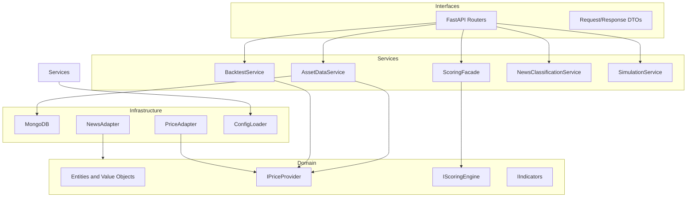
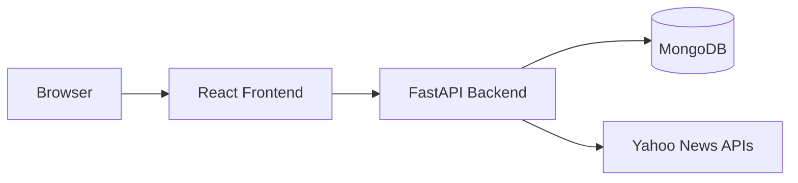
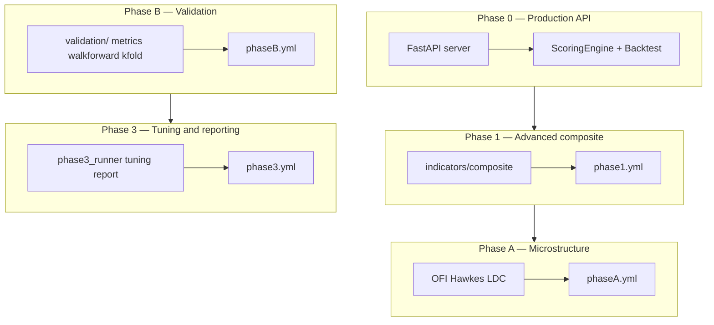
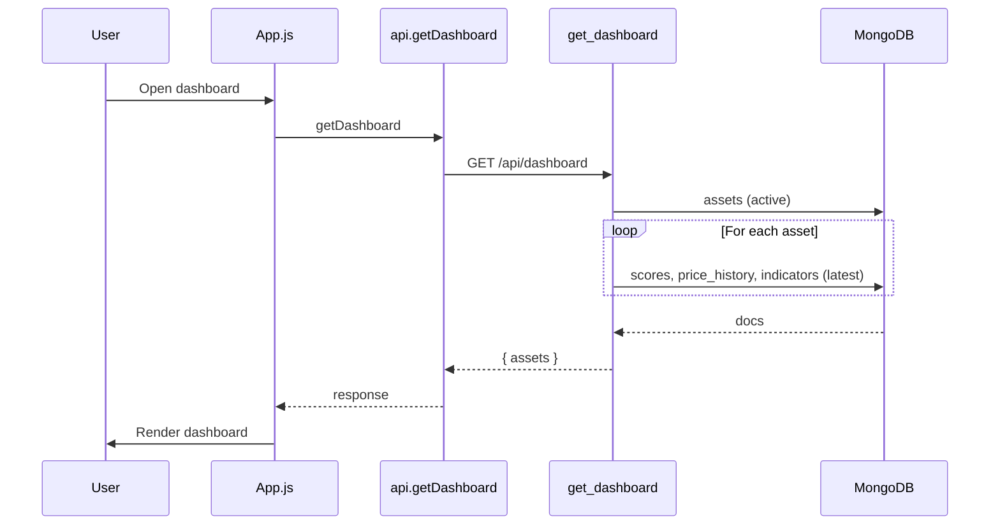
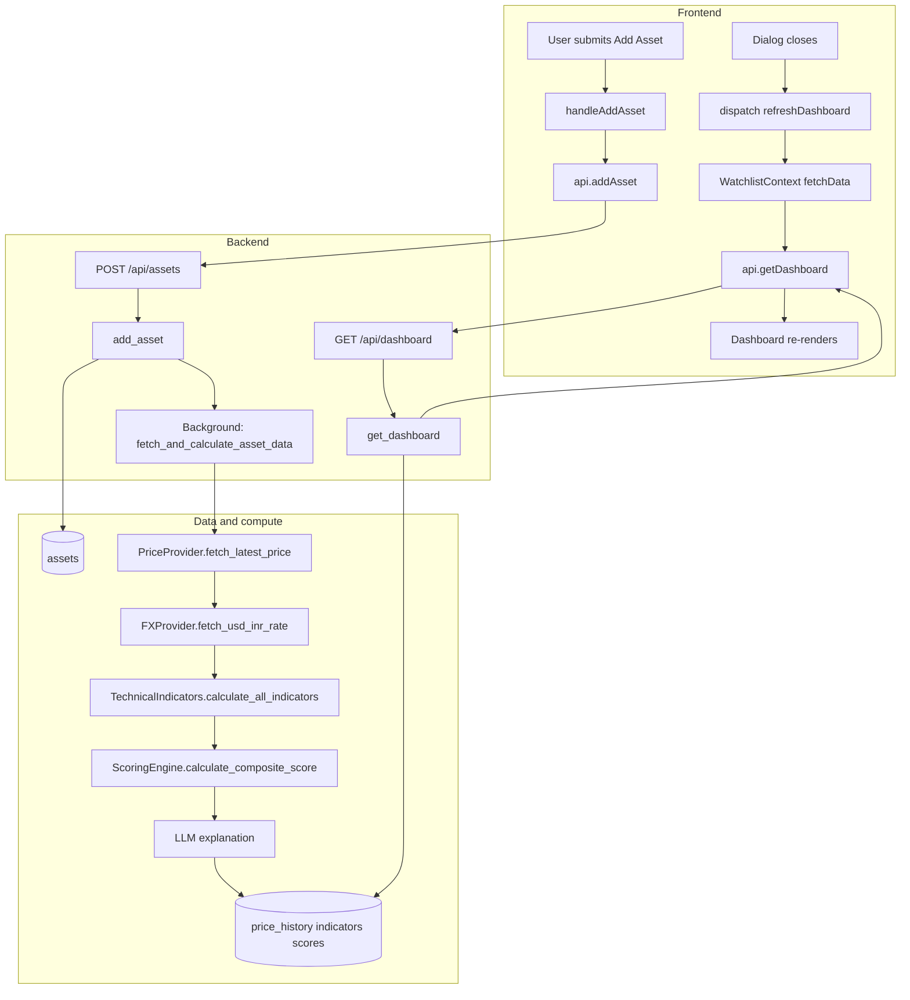
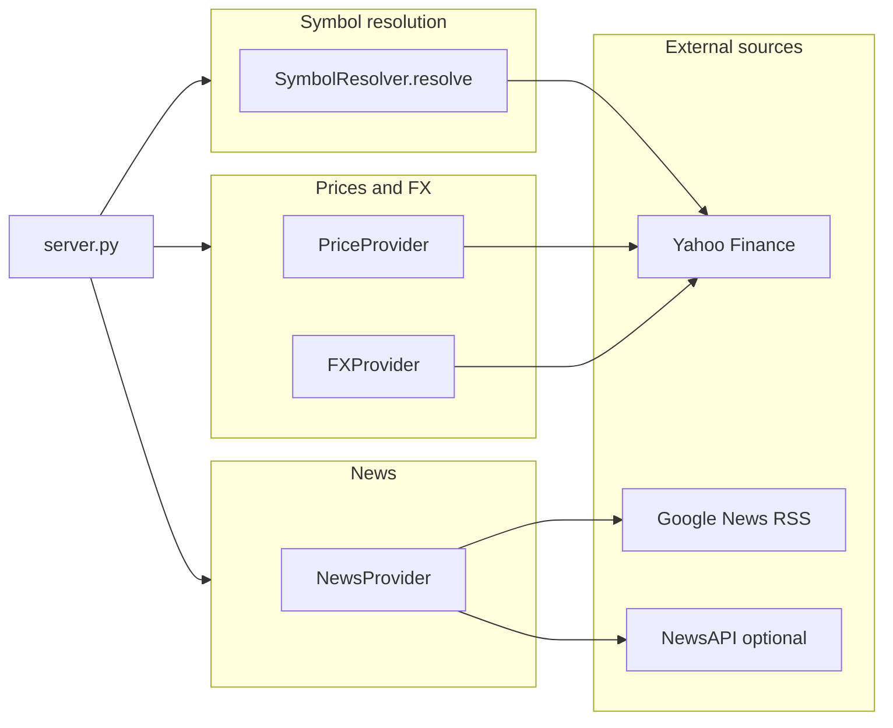

# Quantfi Architecture

This document is the **architecture reference** for the Quantfi DCA Intelligence Platform. It explains how the system is built, where logic lives, how data flows, and how formulas are defined and optimized—so you can navigate the repo and extend it with confidence.

---

## Layered architecture (refactored)

The codebase is organized in four layers. Dependency flow is one-way: interfaces → services → domain; infrastructure implements domain protocols.



- **Domain** (`domain/`): Protocols (IPriceProvider, IScoringEngine, IIndicators, etc.); no FastAPI or DB imports.
- **Infrastructure** (`infrastructure/`): PriceAdapter, FXAdapter, NewsAdapter (yfinance/NewsAPI), ConfigLoader for YAML.
- **Services** (`services/`): AssetDataService, ScoringFacade, BacktestService, NewsClassificationService, SimulationService; orchestrate domain and infrastructure.
- **Interfaces** (`backend/`): FastAPI app, routes in `backend/routes/`, DTOs in `backend/models.py`. Composition root and DI in `backend/container.py`; see [docs/PATTERNS.md](PATTERNS.md) and [docs/REFACTOR_SUMMARY.md](REFACTOR_SUMMARY.md).

---

## How to use this document

| You want to… | Jump to |
|--------------|--------|
| See the big picture and phase roadmap | [1. High-level architecture](#1-high-level-architecture) and [Phase roadmap](#phase-roadmap) |
| Find which file owns a feature | [2. Backend](#2-backend-architecture), [3. Frontend](#3-frontend-architecture), [12. Where to find X](#12-glossary-and-where-to-find-x) |
| Understand a user journey end-to-end | [5. Key end-to-end flows](#5-key-end-to-end-flows) |
| See formulas and math | [7. Mathematical formulations](#7-mathematical-formulations) |
| See how data is fetched and cached | [8. Data acquirement](#8-data-acquirement), [Caching](#caching-strategy) |
| Understand backtest vs portfolio sim | [9. Backtesting](#9-backtesting-methodology), [10. Portfolio simulation](#10-portfolio-simulation-and-how-it-is-backtested) |
| See how parameters are optimized | [11. Formula and parameter optimization](#11-formula-and-parameter-optimization) |

---

## 1. High-level architecture

**Stack:** React (Vite) frontend, FastAPI backend, MongoDB, external data (Yahoo Finance via yfinance, news via RSS/NewsAPI).

**Repo layout:** `frontend/`, `backend/`, `indicators/`, `validation/`, `backtester/`, `simulations/`, `config/`, `tests/`.



### Phase roadmap

The codebase is organized in **phases**. The **production API** (what the frontend uses today) is **Phase 0**: core DCA scoring, backtest, dashboard, news, sentiment. Additional phases add advanced indicators, validation, and tuning; some are wired via config and tests rather than HTTP.



| Phase | Purpose | Config | Exposed via API? |
|-------|--------|--------|-------------------|
| **Phase 0** | Core: assets, prices, indicators, DCA score, backtest, dashboard, news, sentiment, simulation | [backend/app_config.py](backend/app_config.py), env | Yes — all `/api` routes |
| **Phase 1** | Advanced composite score (T_t, U_t, V_t, Gate, Opp, g_pers, committee) | [config/phase1.yml](config/phase1.yml) | No — [backend/phase1_routes.py](backend/phase1_routes.py) exists but is **not mounted** in server |
| **Phase A** | Microstructure: OFI, Hawkes, LDC, normalization, Phase A composite | [config/phaseA.yml](config/phaseA.yml) | Partially — Phase A endpoints in api.js; backend may proxy or compute on demand |
| **Phase B** | Data integrity, walk-forward, purged K-fold, execution model | [config/phaseB.yml](config/phaseB.yml) | No — used by validation and tests |
| **Phase 3** | Nested CV tuning, ablation, Hawkes stress, HTML reports | [config/phase3.yml](config/phase3.yml) | No — CLI: `python -m validation.phase3_runner` |

> **Knowledge gap:** The **Signals API** (`/api/signals/*`) is defined in [frontend/src/api.js](frontend/src/api.js) (getSignalsSummary, getActiveSignals, getSignalHistory, etc.) but has **no corresponding routes** in the backend today. Those calls would 404 unless you add signal persistence and endpoints.

---

## 2. Backend architecture

**Entry and routing**

- [backend/server.py](backend/server.py): FastAPI app created via `create_app()`; includes router from `create_api_router()`, CORS, lifespan (MongoDB client and Container). Run from repo root with `PYTHONPATH=.` and `uvicorn backend.server:app`.
- Routes are split into [backend/routes/](backend/routes/): assets, prices, indicators, scores, backtest, news, settings, dashboard, sentiment, simulation, health. Each route uses `Depends(get_container)` to obtain the Container; the Container holds the DB and all services/adapters.
- All HTTP endpoints live under `/api` (e.g. `/api/assets`, `/api/dashboard`, `/api/backtest`).

**Core modules**

| Module | File | Key types / functions |
|--------|------|------------------------|
| Models | [backend/models.py](backend/models.py) | `Asset`, `PriceData`, `IndicatorData`, `ScoreBreakdown`, `DCAScore`, `NewsEvent`, `BacktestConfig`, `BacktestResult`, `UserSettings`, `SimulationRequest`, `SimulationExitConfig` |
| Config | [backend/app_config.py](backend/app_config.py) | `get_backend_config()` — TTLs, score zones, LLM keys |
| Data providers | [backend/data_providers.py](backend/data_providers.py) | `PriceProvider.fetch_latest_price`, `fetch_historical_data`; `FXProvider.fetch_usd_inr_rate`; `NewsProvider.fetch_latest_news`, `fetch_news_for_assets`; `SymbolResolver` |
| Indicators (backend) | [backend/indicators.py](backend/indicators.py) | `TechnicalIndicators`: `calculate_all_indicators`, `calculate_sma`, `calculate_ema`, `calculate_rsi`, `calculate_macd`, `calculate_bollinger_bands`, `calculate_atr`, `calculate_atr_percentile`, `calculate_z_score`, `calculate_drawdown`, `calculate_adx` |
| Scoring | [backend/scoring.py](backend/scoring.py) | `ScoringEngine.calculate_composite_score`, `get_zone`, `calculate_technical_momentum_score`, `calculate_volatility_opportunity_score`, `calculate_statistical_deviation_score`, `calculate_macro_fx_score` |
| Backtest | [backend/backtest.py](backend/backtest.py) | `BacktestEngine.run_backtest`, `_compute_rolling_scores` |
| LLM | [backend/llm_service.py](backend/llm_service.py) | `LLMService.generate_score_explanation`, `classify_news_event` |
| Sentiment | [indicators/sentiment_agent.py](indicators/sentiment_agent.py) | `full_sentiment_analysis`, `compute_sentiment_G_t` (via `_get_sentiment_mod()` in server) |

**API endpoint summary**

- Assets: `POST /assets`, `GET /assets`, `DELETE /assets/{symbol}`.
- Prices: `GET /prices/{symbol}`, `GET /prices/{symbol}/history`.
- Indicators / scores: `GET /indicators/{symbol}`, `GET /scores/{symbol}`.
- Backtest: `POST /backtest` (and enhanced if present).
- News: `GET /news`, `GET /news/asset/{symbol}`, `POST /news/refresh`.
- Sentiment: `GET /sentiment/{symbol}`, `POST /sentiment/{symbol}`.
- Dashboard: `GET /dashboard`.
- Settings: `GET /settings`, `PUT /settings`.
- Simulation: `GET /simulation/templates`, `GET /simulation/cost-presets`, `POST /simulation/run`.
- Health: `GET /health`.

**Server-side flow (add asset → dashboard)**

- `add_asset` → insert/update `assets` → background task `fetch_and_calculate_asset_data(symbol, ...)` → fetch price (PriceProvider), FX (FXProvider), compute indicators (TechnicalIndicators), composite score (ScoringEngine), persist to `price_history`, `indicators`, `scores`.
- `get_dashboard` → read active assets from `assets` → for each symbol, latest from `scores`, `price_history`, `indicators` → return `{ assets: [...] }`.



**Caching strategy**

Caches are **time-based** and stored in MongoDB. If the latest document is newer than the TTL, the API returns it and skips external calls or recomputation.

| Resource | Collection | TTL (config key) | When refreshed |
|----------|------------|-------------------|-----------------|
| Price | `price_history` | `cache_price_minutes` (default 5) | On demand when stale; also by `fetch_and_calculate_asset_data` |
| Indicators | `indicators` | `cache_indicators_hours` (default 1) | On demand when stale; also by background task after add asset |
| Score | `scores` | `cache_scores_hours` (default 1) | Same as indicators |
| News | `news_events` | `cache_news_hours` (default 3) | On `/news/refresh` |
| Sentiment | `sentiment` | Same as scores | On POST `/sentiment/{symbol}` |

---

## 3. Frontend architecture

**Entry and routing**

- [frontend/src/index.js](frontend/src/index.js): mounts `App` with `index.css`.
- [frontend/src/App.js](frontend/src/App.js): `BrowserRouter`, `WatchlistProvider` wrapping layout, `Routes` for `/`, `/assets`, `/assets/:symbol`, `/backtest`, `/simulation`, `/news`, `/settings`. Add Asset dialog state and `handleAddAsset`; global events `addAsset`, `refreshDashboard`.

**Context**

- [frontend/src/contexts/WatchlistContext.js](frontend/src/contexts/WatchlistContext.js): `WatchlistProvider`, `useWatchlist()`. State: `dashboardData` (from `api.getDashboard()`), `loading`, `refreshing`, `error`. Derived: `assetList`. Actions: `refresh()`, `removeAsset(symbol)`. Listens to `refreshDashboard`.

**API layer**

- [frontend/src/api.js](frontend/src/api.js): single `api` object; base `BACKEND_URL` / `API`; methods: `getAssets`, `addAsset`, `removeAsset`, `getLatestPrice`, `getPriceHistory`, `getIndicators`, `getScore`, `getDashboard`, `runBacktest`, `getNews`, `refreshNews`, `getSentiment`, `runSentiment`, `getSettings`, `updateSettings`, `runSimulation`, `getSimulationTemplates`, `getSimulationCostPresets`, etc.

**Pages**

- **Dashboard** ([frontend/src/pages/Dashboard.js](frontend/src/pages/Dashboard.js)): watchlist overview, DCA scores/zones, Opportunity Radar, Portfolio Health, Allocation, Smart Alerts, Quick Glance.
- **Assets** ([frontend/src/pages/Assets.js](frontend/src/pages/Assets.js)): watchlist table, filters, score heatmap, remove asset.
- **AssetDetail** ([frontend/src/pages/AssetDetail.js](frontend/src/pages/AssetDetail.js)): single-asset price, indicators, score, sentiment, news.
- **BacktestLab** ([frontend/src/pages/BacktestLab.js](frontend/src/pages/BacktestLab.js)): symbol picker (AssetPicker), date range, DCA params, run backtest, equity curve and KPIs.
- **PortfolioSim** ([frontend/src/pages/PortfolioSim.js](frontend/src/pages/PortfolioSim.js)): templates, run simulation, Overview/Costs/Sensitivity tabs.
- **News** ([frontend/src/pages/News.js](frontend/src/pages/News.js)): news feed, filter by asset, refresh.
- **Settings** ([frontend/src/pages/Settings.js](frontend/src/pages/Settings.js)): DCA defaults, score weights, execution model.
- **ValidationLab** ([frontend/src/pages/ValidationLab.js](frontend/src/pages/ValidationLab.js)): Phase 3 validation UI; not mounted in router.

**Shared components**

- [frontend/src/components/shared/index.js](frontend/src/components/shared/index.js): barrel for `StatCard`, `ScoreBar`, `ZoneBadge`, `RefreshButton`, `PageShell`, `AssetPicker`, `FilterTabs`, `MetricGrid`.
- UI primitives under [frontend/src/components/ui/](frontend/src/components/ui/): `dialog`, `button`, `input`, `label`, `select`, `tabs`, etc.

**Frontend utilities** ([frontend/src/utils.js](frontend/src/utils.js))

Used across Dashboard, Assets, and detail views for consistent formatting and zone/score mapping:

| Export | Purpose |
|--------|---------|
| `formatCurrency(value, currency)` | Intl-based USD/INR formatting |
| `formatNumber(value, decimals)` | Numeric display |
| `formatPercent(value, decimals)` | Signed percent (e.g. +2.50%) |
| `getScoreColor(score)` | Hex by band: ≥81 green, ≥61 teal, ≥31 amber, &lt;31 red |
| `getZoneLabel(zone)` | strong_buy → "STRONG BUY DIP", favorable → "FAVORABLE", etc. |
| `getAssetSymbol(symbol)` | Pass-through (extensibility) |

Zone and score bands match backend: strong_buy ≥81, favorable ≥61, neutral ≥31, unfavorable &lt;31.

---

## 4. Python packages (outside backend server)

**indicators/** ([indicators/__init__.py](indicators/__init__.py))

- Purpose: Phase 1/A composite scores, normalization, microstructure (OFI, Hawkes), sentiment, trend, volatility, liquidity, geopolitics, LDC, committee.
- Key exports: `IndicatorEngine`, `compute_all_indicators`; `compute_composite_score`, `CompositeResult`, `Phase1Composite`; `compose_scores`, `PhaseAConfig`, `load_phaseA_config`; `full_sentiment_analysis`, `compute_sentiment_G_t`; `compute_ofi`, `estimate_hawkes`; normalization helpers (`expanding_percentile`, `normalize_to_score`, etc.).

**validation/** ([validation/__init__.py](validation/__init__.py))

- Purpose: Phase B+3 validation, metrics, walk-forward, purged K-fold, data integrity, execution model (slippage, costs), tuning, report generation.
- Key exports: `walkforward_cv`, `purged_kfold`, `validate_dataframe`, `generate_report`, `ExecutionConfig`, `apply_execution_costs`, `run_tuning`, `ablation_study`, etc.

**backtester/** ([backtester/__init__.py](backtester/__init__.py))

- Purpose: DCA backtest, diagnostic backtester, purged validation, signal sweep, DCA portfolio sim, and the **portfolio simulator** used by the API.
- Key for API: [backtester/portfolio_simulator.py](backtester/portfolio_simulator.py) — `PortfolioSimulator`, `SimConfig`, `ExitParams`, `prepare_multi_asset_data`, `run`, `COST_PRESETS`.

**simulations/** ([simulations/__init__.py](simulations/__init__.py))

- Purpose: Hawkes process simulation, synthetic LOB/trade generation (Phase 3).
- Key exports: `simulate_hawkes_events`, `generate_synthetic_lob`, `generate_synthetic_trades`, etc.

### Config and environment

| Layer | What | Where |
|-------|------|--------|
| Backend runtime | TTLs, score zones, rules, LLM keys, news/FX defaults | [backend/app_config.py](backend/app_config.py); overrides via `BACKEND_*` env vars |
| Phase 1 | HMM, committee, g_pers, normalization, windows, data_providers | [config/phase1.yml](config/phase1.yml) (loaded by indicators/composite and tests) |
| Phase A | Microstructure and Phase A composite | [config/phaseA.yml](config/phaseA.yml) |
| Phase B | Validation and data integrity | [config/phaseB.yml](config/phaseB.yml) |
| Phase 3 | Tuning, walk-forward, reporting, Hawkes stress | [config/phase3.yml](config/phase3.yml); CLI: `python -m validation.phase3_runner` |
| Frontend | Backend URL | `REACT_APP_BACKEND_URL` (default `http://localhost:8000`) |
| Backend | MongoDB, optional News API | `MONGO_URL`, `DB_NAME`, `NEWS_API_KEY` (optional) |

### Test layout

Tests live under [tests/](tests/). Naming reflects the phase or module they validate:

| Pattern | Purpose |
|---------|--------|
| `test_phase3*.py`, `test_phaseB*.py`, `test_phaseA*.py` | Phase 3/B/A validation, tuning, metrics, signals, sweep |
| `test_composite_pipeline.py`, `test_normalization.py`, `test_hurst.py`, `test_vwap_z.py` | Indicator and composite pipeline |
| `test_ofi.py`, `test_hawkes.py`, `test_ldc.py` | Microstructure (OFI, Hawkes, LDC) |
| `test_sentiment_agent_*.py` | Sentiment agent |
| [tests/fixtures.py](tests/fixtures.py) | Shared fixtures for deterministic data |

Frontend tests: [frontend/src/__tests__/](frontend/src/__tests__/) (e.g. Dashboard, Sidebar, shared components).

---

## 5. Key end-to-end flows

**Flow A: Add asset and see it on dashboard**

1. User clicks "ADD ASSET" → `addAsset` event or Sidebar `onAddAsset` → App opens Dialog.
2. User submits form → `handleAddAsset` in App → `api.addAsset(payload)` → backend `POST /api/assets` → `add_asset()` → insert/update `assets`, `asyncio.create_task(fetch_and_calculate_asset_data(...))`.
3. After success: App dispatches `refreshDashboard` → WatchlistContext `fetchData(true)` → `api.getDashboard()` → backend `get_dashboard()` → returns `{ assets: dashboard_data }` → context updates → Dashboard re-renders.

**Flow B: Backtest**

1. User selects symbol (AssetPicker from `assetList`), dates, DCA amount/cadence → Run → `api.runBacktest(config)` → `POST /api/backtest` → `run_backtest()` → `BacktestEngine.run_backtest()` → returns equity curve and KPIs → BacktestLab displays chart and metrics.

**Flow C: Portfolio simulation**

1. User picks template (or custom), runs sim → `api.runSimulation(data)` → `POST /api/simulation/run` → server uses `backtester.portfolio_simulator`, `prepare_multi_asset_data`, `PortfolioSimulator.run()` → returns results → PortfolioSim shows Overview/Costs/Sensitivity.

**Flow D: News refresh**

1. User clicks Refresh on News → `api.refreshNews()` → `POST /api/news/refresh` → `refresh_news()` → fetch + classify (LLM), store in `news_events` → frontend re-fetches `getNews()` to show updated feed.

**How the pieces fit together (Add Asset → Dashboard)**

From the moment the user submits the Add Asset form to the dashboard showing the new asset, the following chain runs. The pipeline is the same logic used later for periodic or on-demand refresh of that asset.



---

## 6. Data structures

**Backend (Pydantic in [backend/models.py](backend/models.py))**

- **Asset:** `symbol`, `name`, `asset_type`, `exchange`, `currency`, `is_active`, `created_at`.
- **PriceData:** `symbol`, `timestamp`, `price_usd`, `price_inr`, `usd_inr_rate`, `volume`.
- **IndicatorData:** `symbol`, `timestamp`, `sma_50`, `sma_200`, `ema_50`, `rsi_14`, `macd`, `macd_signal`, `macd_hist`, `bb_upper`/`bb_middle`/`bb_lower`, `atr_14`, `atr_percentile`, `z_score_20`/`50`/`100`, `drawdown_pct`, `adx_14`.
- **DCAScore:** `symbol`, `timestamp`, `composite_score`, `zone`, `breakdown` (ScoreBreakdown), `explanation`, `top_factors`.
- **NewsEvent:** `title`, `description`, `source`, `url`, `published_at`, `event_type`, `affected_assets`, `impact_scores`, `summary`.
- **BacktestConfig / BacktestResult:** config (symbol, dates, dca_amount, dca_cadence, buy_dip_threshold), KPIs (total_invested, total_units, final_value_usd/inr, total_return_pct, annualized_return_pct, num_regular_dca, num_dip_buys, max_drawdown_pct, avg_cost_basis), `equity_curve` (list of EquityPoint).
- **SimulationRequest / SimulationExitConfig:** symbols, start_date, end_date, initial_capital, entry_score_threshold, exit_config (atr_init_mult, atr_trail_mult, min_stop_pct, score_rel_mult, score_abs_floor, max_holding_days), max_positions, use_score_weighting, slippage_bps, template.

**Frontend**

- Dashboard payload: `{ assets: [{ asset, score, price, indicators }] }`.
- Backtest/simulation responses: equity curve, KPIs, cost breakdown as returned by API.

**MongoDB collections**

- `assets`, `price_history`, `indicators`, `scores`, `news_events`, `user_settings`, `backtest_results`, `sentiment`, `simulation_results`.

---

## 7. Mathematical formulations

Notation used below: **P** = price (close), **C** = close, **H** = high, **L** = low; subscript **t** = time (bar index); **n** = lookback period. All formulas match [backend/indicators.py](backend/indicators.py).

### 7.1 Technical indicators ([backend/indicators.py](backend/indicators.py))

- **SMA (Simple Moving Average), period n**
  - **SMA_t = (1/n) × (P_{t−n+1} + … + P_t)**  
  - Average of the last n closing prices.

- **EMA (Exponential Moving Average), span**
  - **EMA_t = α × P_t + (1 − α) × EMA_{t−1}**  
  - **α = 2 / (span + 1)** (e.g. span 14 → α ≈ 0.133).

- **RSI (Relative Strength Index), period 14**
  - **gain** = mean of positive close-to-close changes over 14 bars.  
  - **loss** = mean of absolute negative changes over 14 bars.  
  - **RS = gain / loss** (if loss = 0, RSI = 100).  
  - **RSI = 100 − 100/(1 + RS)**.

- **MACD**
  - **MACD_line = EMA_12(P) − EMA_26(P)**  
  - **Signal = EMA_9(MACD_line)**  
  - **Histogram = MACD_line − Signal**

- **Bollinger Bands (period 20, 2σ)**
  - **Mid = SMA_20(P)**  
  - **Upper = Mid + 2 × σ_20**  
  - **Lower = Mid − 2 × σ_20**  
  - σ_20 = rolling standard deviation of P over 20 bars.

- **ATR (Average True Range), period 14**
  - **TR_t = max( H_t − L_t, |H_t − C_{t−1}|, |L_t − C_{t−1}| )**  
  - **ATR_t = SMA_14(TR)** (14-period average of true range).

- **ATR percentile**
  - Over a lookback (e.g. 252 bars), rank of current ATR within that window, expressed as 0–100.

- **Z-score (rolling), period n**
  - **z_t = (P_t − μ_t) / σ_t**  
  - μ_t = rolling mean of P over n bars, σ_t = rolling standard deviation.  
  - Used with n = 20, 50, 100.

- **Drawdown (percent)**
  - **DD_t = (P_t − peak_t) / peak_t × 100**, where **peak_t = max over s≤t of P_s**.  
  - Percentage below the running high.

- **ADX (Average Directional Index), period 14**
  - +DM = up moves (high minus prior high when > prior low move).  
  - −DM = down moves (prior low minus low when > prior high move).  
  - TR = true range (same as ATR).  
  - +DI = 100 × smoothed(+DM) / ATR, −DI = 100 × smoothed(−DM) / ATR.  
  - DX = 100 × |+DI − −DI| / (+DI + −DI).  
  - **ADX = 14-period smoothed(DX)**.

### 7.2 Composite DCA score ([backend/scoring.py](backend/scoring.py))

Four sub-scores (0–100 each) are combined with configurable weights (defaults in [backend/app_config.py](backend/app_config.py)):

- **S_composite = w_T × S_T + w_V × S_V + w_S × S_S + w_M × S_M**
  - Default weights: technical_momentum 0.4, volatility_opportunity 0.2, statistical_deviation 0.2, macro_fx 0.2.

- **S_T (Technical momentum):** SMA 200 (price below/above), RSI (oversold/overbought bands), MACD (bull/bear cross), Bollinger (price vs lower band), ADX (low/high trend).
- **S_V (Volatility opportunity):** ATR percentile (high vol = opportunity), drawdown bands (severe/medium/light dip bonuses).
- **S_S (Statistical deviation):** Average of 20/50/100-day z-scores; bonuses for negative z (price below mean), penalties for positive z.
- **S_M (Macro FX):** USD-INR deviation from historical average; bonuses when INR is favourable, penalties when USD is expensive.

Each sub-score starts at 50 and is adjusted by rule-based bonuses/penalties (thresholds and deltas in `technical_rules`, `volatility_rules`, `statistical_rules`, `macro_fx_rules` in config). Final composite is clamped to [0, 100].

**Score → Zone mapping** (same in backend and frontend):

```
  composite_score ≥ 81  →  strong_buy   (green)   "STRONG BUY DIP"
  composite_score ≥ 61  →  favorable   (teal)    "FAVORABLE"
  composite_score ≥ 31  →  neutral     (amber)   "NEUTRAL"
  composite_score < 31  →  unfavorable (red)     "UNFAVORABLE"
```

### 7.3 Backtest formulas ([backend/backtest.py](backend/backtest.py))

- **DCA dates:** For cadence `weekly`, dates every 7 days; for `monthly`, same calendar day each month (with end-of-month handling).
- **Regular DCA:** On each DCA date: **units = dca_amount / Close**; **total_units += units**; **total_invested += dca_amount**.
- **Dip buy:** If **score ≥ buy_dip_threshold** on that date, additional **0.5 × dca_amount** is invested at same close (extra units and invested).
- **Portfolio value (per point):** **portfolio_value = total_units × Close**.
- **Total return (percent):** **total_return_pct = ((V_final − total_invested) / total_invested) × 100**.
- **Annualized return (percent):** **ann_return_pct = ((V_final / total_invested)^(1/years) − 1) × 100**, with **years = (end_date − start_date).days / 365.25**.
- **Max drawdown:** Over equity curve: **peak_t = max over s≤t of portfolio_value_s**; **dd_t = (portfolio_value_t − peak_t) / peak_t × 100**; reported **max_drawdown_pct = min(dd)**.
- **Average cost basis:** **avg_cost_basis = total_invested / total_units**.

Rolling scores per bar are computed by `_compute_rolling_scores`: same indicators and `ScoringEngine.calculate_composite_score` as in the live pipeline, so the backtest uses the same scoring logic historically.

### 7.4 Portfolio simulation ([backtester/portfolio_simulator.py](backtester/portfolio_simulator.py))

**Cost model**

- **Execution price (slippage):** **P_exec = P_raw × (1 ± slippage_bps/10^4)** (buy: +, sell: −).
- **Trade cost (one side):** **cost = notional × (bps_round_trip / 20_000) + fixed_per_trade_inr / 2**. Round-trip is split 50/50 per side. Presets: IN_EQ (40 bps, 20 INR fixed), US_EQ_FROM_IN (140 bps), COMMODITY (30 bps), CRYPTO (80 bps), INDEX (40 bps).

**Vectorized scorer**

- Same economic rules as `ScoringEngine` but implemented in NumPy over full price/indicator arrays for speed (technical momentum, volatility opportunity, statistical deviation, macro FX). Returns composite score array and ATR array for exit logic.

**Exit framework (OR logic)**

- **Trailing stop:** **stop = peak_price − atr_trail_mult × ATR**.
- **Initial stop:** **init_stop = entry_price − atr_init_mult × ATR**.
- **Min stop:** **min_stop_price = entry_price × (1 − min_stop_pct/100)**. Effective stop = max(trailing, initial, min_stop); trailing is only active after `min_hold_before_trail` days.
- **Score exit:** Exit when **score < entry_score × score_rel_mult** and **score < score_abs_floor**.
- **Time exit:** Exit when **days_held ≥ max_holding_days**.

Entry: when composite score ≥ entry_score_threshold, position size can be score-weighted; next-day open execution with slippage and trade costs applied.

**Exit logic: OFI and lambda (Phase A)**

The API portfolio simulator ([backtester/portfolio_simulator.py](backtester/portfolio_simulator.py)) uses **only** ATR trailing/initial stop, score-threshold exit, and max-holding-days time exit. It does **not** use Order Flow Imbalance (OFI) or Hawkes lambda decay for exits. Phase A composite ([indicators/composite.py](indicators/composite.py)) computes **Exit_raw** from **OFI_rev** (OFI reversal) and **lambda_decay** (Hawkes intensity decay), which are available for research and validation (e.g. Phase 3, signal studies). Wiring OFI/lambda into the sim would require a daily or bar-level proxy for these series (Phase A is tick-level) and is not implemented; an aggressive unwind based on OFI or lambda flip can be added later if the data path (daily vs tick) is clarified.

### Look-ahead and data correctness

Every indicator and score at time **t** uses only data at or before **t** (no future data).

- **[indicators/normalization.py](indicators/normalization.py):** `expanding_percentile(series)` uses **historical = series[:t]** for each index t; `normalize_to_score` and `expanding_ecdf_sigmoid` use expanding windows only (no `.shift(-k)` or access to future bars).
- **[indicators/composite.py](indicators/composite.py):** All rolling/expanding windows use past data only; no negative shifts.
- **[backend/backtest.py](backend/backtest.py):** `_compute_rolling_scores(df)` loops over bar index **i** and uses only **iloc[i]** and earlier for indicators and `ScoringEngine.calculate_composite_score`; signal at bar i is computed from data 0..i only.

A checksum-style test in [tests/test_lookahead.py](tests/test_lookahead.py) verifies that appending a future value to a series does not change `expanding_percentile` or `normalize_to_score` results on the original index; this would fail if any code path used future data.

### Currency and FX consistency

USD↔INR conversion is applied once at storage; no double conversion in the scoring or sim price path.

- **[backend/data_providers.py](backend/data_providers.py):** Returns raw Yahoo price in the asset’s listing currency (no FX conversion in the provider).
- **Backend storage ([backend/server.py](backend/server.py) `fetch_and_calculate_asset_data`):** For USD assets, **price_inr = price × usd_inr_rate** and **price_usd = price** (single conversion at storage). For INR assets, **price_inr = price**, **price_usd = price_inr / usd_inr_rate**. No FX is applied again downstream for the same price.
- **[backtester/portfolio_simulator.py](backtester/portfolio_simulator.py):** `prepare_multi_asset_data` uses Yahoo Close as-is (listing currency). Sim prices are therefore in USD or INR per asset. `vectorized_scores` uses **usd_inr_rate** only for the macro (S_M) component, not to convert prices. **trade_cost(notional, cost_class):** notional is in the asset’s currency (USD or INR). The cost preset applies **bps_round_trip** to that notional and adds **fixed_per_trade_inr** (INR). So for a USD asset, cost = (USD notional × bps) + (INR fixed); the reported cost is a mixed convention (same numeric sum) and is used for P&L in the sim's single-currency accounting. No code path applies FX to the same price twice.

---

## 8. Data acquirement

**Price and FX ([backend/data_providers.py](backend/data_providers.py))**

- **Source:** Yahoo Finance via `yfinance`. Ticker symbol is resolved by `SymbolResolver.resolve(symbol, exchange)` (aliases and exchange suffixes from config).
- **Historical OHLCV:** `PriceProvider.fetch_historical_data(symbol, period=..., start_date=..., end_date=..., exchange=...)` calls `yf.Ticker(provider_symbol).history(...)`; columns normalized to `Open`, `High`, `Low`, `Close`, `Volume`.
- **Latest price:** `fetch_latest_price(symbol, exchange)` uses a short history window (e.g. `latest_price_period` = "5d"), returns last close, volume, timestamp.
- **USD-INR:** `FXProvider.fetch_usd_inr_rate()` uses `yf.Ticker('USDINR=X').history(...)`; on failure falls back to `fx_fallback_usd_inr` (e.g. 83.5).

**News**

- **NewsAPI (optional):** If `NEWS_API_KEY` is set, `NewsProvider.fetch_latest_news(query, page_size)` uses NewsAPI with query and lookback window (`news_lookback_days`).
- **RSS fallback:** `_fetch_rss_news(query, limit)` uses Google News RSS (`news_rss_base` with `{query}`) and optional `news_rss_business`; parses XML, extracts title, description, link, pubDate, source.
- **Per-asset news:** `fetch_news_for_assets(symbols, per_asset)` builds keywords from `SymbolResolver.get_news_keywords(symbol)` (name, symbol, sector, quote type) and fetches RSS (or API) per asset; deduplicates by URL and sorts by date.

**Symbol resolution**

- `SymbolResolver.resolve(symbol, exchange)` applies `symbol_aliases` and `exchange_suffixes` from config so the same logical asset maps to the correct Yahoo ticker (e.g. `.NS`, `=F`, `-USD`).

**Data acquirement at a glance**



---

## 9. Backtesting methodology

**Single-asset DCA backtest ([backend/backtest.py](backend/backtest.py))**

1. **Data:** Historical OHLCV for the symbol over a range that includes the backtest window (with padding if needed). Minimum bars for full indicator suite is 200.
2. **Scores:** Either provided or computed by `BacktestEngine._compute_rolling_scores(df)`: for each bar, compute SMA 50/200, RSI 14, MACD, Bollinger, ATR, ATR percentile, z-scores (20/50/100), drawdown, ADX; then call `ScoringEngine.calculate_composite_score` with current close and USD-INR rate. No look-ahead: only past and current data.
3. **Schedule:** DCA dates are generated by `_get_dca_dates(start_date, end_date, cadence)` (weekly or monthly).
4. **Execution:** On each DCA date, use the first available trading day on or after that date; buy at close. If `buy_dip_threshold` is set and score ≥ threshold, add a 50% extra DCA amount the same day.
5. **Metrics:** Total invested, total units, final value (USD and INR), total return %, annualized return %, number of regular and dip buys, max drawdown % on the equity curve, average cost basis. Equity curve is downsampled if more than 500 points for response size.

**Validation of backtest logic**

- The same indicator and scoring formulas used in production (indicators.py, scoring.py) are used in the backtest; the only difference is batch (rolling) computation. Portfolio simulator uses a vectorized reimplementation of the same scoring rules for consistency and speed.

**Backtest vs portfolio sim (conceptually)**

| Aspect | Single-asset backtest (BacktestLab) | Portfolio sim (PortfolioSim) |
|--------|--------------------------------------|------------------------------|
| Scope | One symbol, DCA schedule only | Multiple symbols, score-driven entry/exit |
| Execution | Buy at close on DCA dates; optional dip buy same day | Next-day open; slippage and per-asset cost class |
| Exit | None (accumulate only) | ATR stop, score mean-reversion, max holding days |
| Output | Equity curve, return %, drawdown, cost basis | Multi-asset PnL, benchmarks, cost/sensitivity tabs |

---

## 10. Portfolio simulation and how it is backtested

**Simulation design ([backtester/portfolio_simulator.py](backtester/portfolio_simulator.py))**

1. **Data preparation:** `prepare_multi_asset_data` fetches history for all symbols (with padding for warm-up), builds a common date index, forward-fills for mark-to-market on non-trading days, computes vectorized scores and ATR per asset. `first_valid_idx` = start of data plus `warm_up_bars` (e.g. 200) so indicators are valid.
2. **Entry:** Each day, for each asset not already held, if score ≥ `entry_score_threshold` and capital allows, open a position (size can be score-weighted). Execution at next open with `execution_price(open, 'buy', slippage_bps)` and `trade_cost(notional, cost_class, 'entry')`.
3. **Exit:** For each position, `check_exit` implements OR of: (a) trailing/initial/min ATR-based stop, (b) score-based mean-reversion exit, (c) max_holding_days. Exit execution uses next open, slippage, and trade cost.
4. **Benchmarks:** Buy-and-hold and uniform periodic investment run over the same dates for comparison.
5. **Analytics:** Sharpe, Sortino, Calmar, CAGR, drawdown, regime analysis (see portfolio_simulator and validation/metrics).

**How the portfolio sim is validated / backtested**

- The strategy is run over historical date ranges with the same data and cost assumptions; results are compared to benchmarks. Validation framework (validation/) provides metrics (e.g. Sortino, IC, hit rate, max drawdown, CAGR) that can be applied to simulation outputs. Tuning (see below) optimizes entry/exit and score parameters on historical data via nested CV so the formula and parameters are backtested in a non-leaking way.

---

## 11. Formula and parameter optimization

**Tuning framework ([validation/tuning.py](validation/tuning.py))**

- **Objective:** Maximize **S(θ) = median_f(M_f) − λ_var × std_f(M_f)**, where **M_f** is the per-fold metric (e.g. Sortino of signal returns), **f** indexes folds, and **λ_var** penalizes variance across folds (default 0.5).
- **Outer loop:** Walk-forward (chronological) splits.
- **Inner loop:** Purged K-fold CV on the outer training set (embargo to avoid leakage). For each candidate **θ**, scores are generated on combined train+test context, but the metric is evaluated only on the test fold.
- **Metrics:** `objective` can be `sortino`, `ic` (information coefficient between score and forward returns), or `ir` (annualized return / volatility). Forward returns: `prices.shift(-horizon)/prices - 1` (e.g. 5-bar).
- **Search:** Grid search, random search, or Bayesian (scikit-optimize) over a configurable `search_space` (e.g. entry/exit thresholds, score weights). Results are logged as JSON for reproducibility.

**Validation metrics ([validation/metrics.py](validation/metrics.py))**

- **Information coefficient:** Spearman correlation between scores and forward returns.
- **Hit rate:** Fraction of times score > threshold coincides with positive forward return.
- **Sortino ratio:** **excess_mean / downside_std × √annualization**; downside = returns below target (e.g. 0).
- **Max drawdown:** **min over t of (equity_t − peak_t) / peak_t** (negative fraction, e.g. −0.15 = −15%).
- **CAGR:** **(equity_T / equity_0)^(1/years) − 1** (compound annual growth rate).

These metrics are used both for reporting and as objectives in tuning, so the composite score formula and its parameters are optimized against historical performance in a structured way.

---

## 12. Glossary and "Where to find X"

### Knowledge gaps (as of this doc)

| Gap | Detail |
|-----|--------|
| **Signals API** | Frontend [api.js](frontend/src/api.js) defines `getSignalsSummary`, `getActiveSignals`, `getSignalHistory`, `getSignalTrades`, `getSignalPerformance`. Backend has no `/api/signals/*` routes; these calls would 404 unless you add them. |
| **Phase 1 HTTP API** | [backend/phase1_routes.py](backend/phase1_routes.py) implements Phase 1 advanced indicators but is **not** included in the FastAPI app in server.py. To expose Phase 1 via HTTP, mount `phase1_router` in server.py. |
| **ValidationLab route** | [frontend/src/pages/ValidationLab.js](frontend/src/pages/ValidationLab.js) exists but no route in App.js (e.g. `/validation`) mounts it. Add a `<Route path="/validation" element={<ValidationLab />} />` to use it. |

### Glossary

- **DCA (Dollar-Cost Averaging):** Investing a fixed amount at fixed intervals (e.g. weekly or monthly), regardless of price.
- **Composite score:** Weighted sum of four sub-scores (technical momentum, volatility opportunity, statistical deviation, macro FX), 0–100, indicating DCA opportunity.
- **Zone:** strong_buy (≥81), favorable (≥61), neutral (≥31), unfavorable (&lt;31).
- **Dip buy:** Optional extra purchase when the composite score is above a threshold on a DCA date (e.g. 50% of regular DCA amount).

**Where to find X**

| Topic | Location |
|-------|----------|
| Add asset logic (backend) | [backend/server.py](backend/server.py) — `add_asset`, `fetch_and_calculate_asset_data` |
| Add asset logic (frontend) | [frontend/src/App.js](frontend/src/App.js) — `handleAddAsset`, Add Asset Dialog |
| Dashboard aggregation | [backend/server.py](backend/server.py) — `get_dashboard` |
| Watchlist state | [frontend/src/contexts/WatchlistContext.js](frontend/src/contexts/WatchlistContext.js) |
| Indicator formulas | [backend/indicators.py](backend/indicators.py) — `TechnicalIndicators` |
| Composite score formula | [backend/scoring.py](backend/scoring.py) — `ScoringEngine.calculate_composite_score` |
| Score weights and zones | [backend/app_config.py](backend/app_config.py) — `default_score_weights`, `score_zone_*`, `*_rules` |
| Backtest engine | [backend/backtest.py](backend/backtest.py) — `BacktestEngine.run_backtest`, `_compute_rolling_scores` |
| Portfolio simulator | [backtester/portfolio_simulator.py](backtester/portfolio_simulator.py) — `PortfolioSimulator`, `vectorized_scores`, `check_exit`, `prepare_multi_asset_data` |
| Cost and slippage | [backtester/portfolio_simulator.py](backtester/portfolio_simulator.py) — `COST_PRESETS`, `execution_price`, `trade_cost` |
| Data fetching (prices, FX) | [backend/data_providers.py](backend/data_providers.py) — `PriceProvider`, `FXProvider` |
| News fetching | [backend/data_providers.py](backend/data_providers.py) — `NewsProvider` |
| Tuning objective and CV | [validation/tuning.py](validation/tuning.py) — `run_tuning`, `_evaluate_inner_cv`, TuningConfig |
| Validation metrics | [validation/metrics.py](validation/metrics.py) — `sortino_ratio`, `information_coefficient`, `forward_returns`, `max_drawdown`, `cagr` |
| Phase 1 composite and config | [indicators/composite.py](indicators/composite.py), [config/phase1.yml](config/phase1.yml) |
| Phase 3 runner (CLI) | [validation/phase3_runner.py](validation/phase3_runner.py) — `python -m validation.phase3_runner` |
| Frontend formatting and zones | [frontend/src/utils.js](frontend/src/utils.js) — `getScoreColor`, `getZoneLabel`, `formatCurrency` |

---

*This architecture document is the single source of truth for navigating the Quantfi repo: from high-level phases and request flows down to formulas, config, and file locations. When you add a new feature or fix a bug, consider updating this doc so the next reader has no knowledge gaps.*
